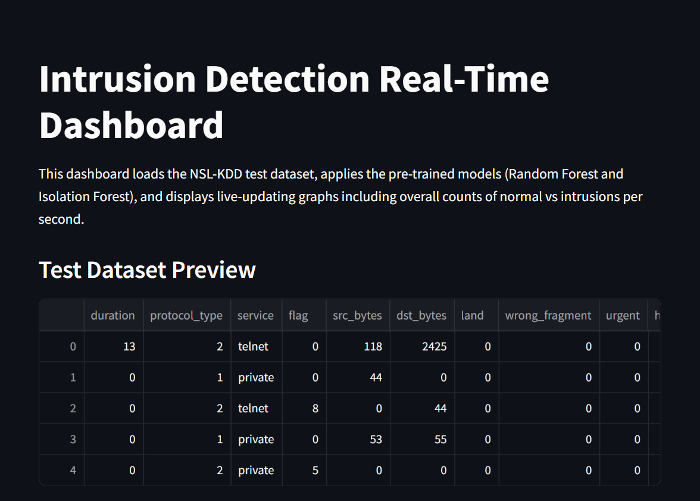
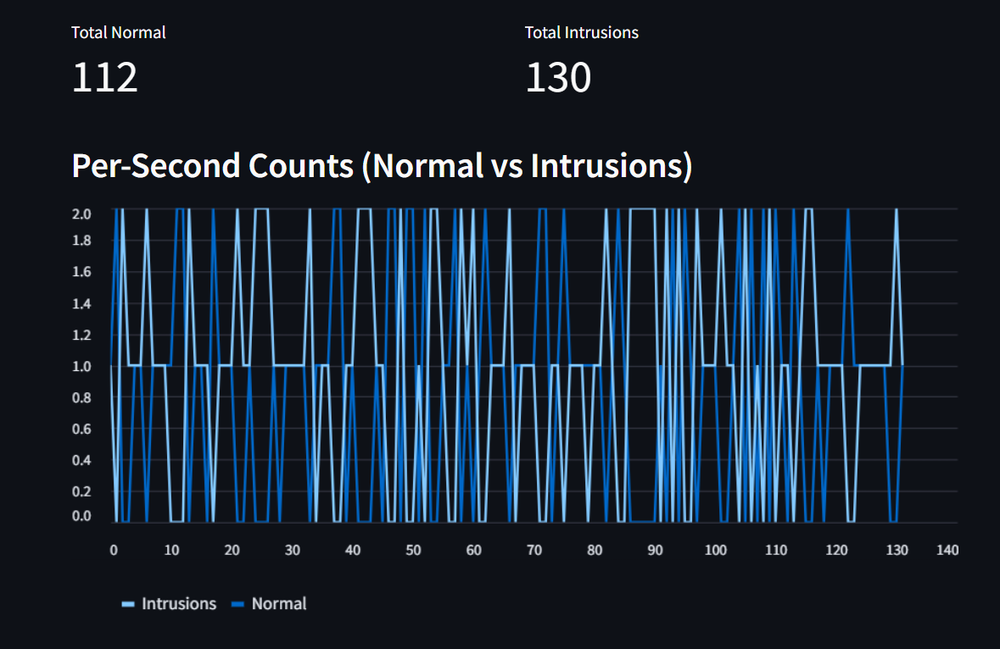
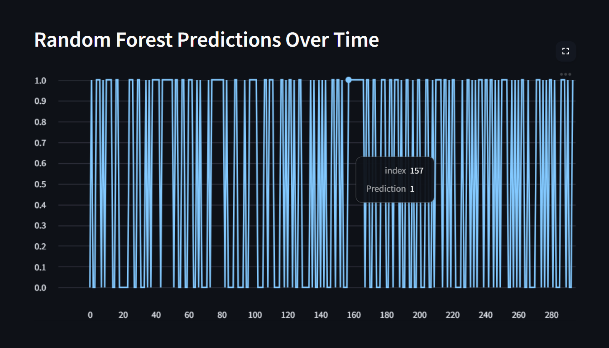

# 🚨 Hybrid Machine Learning-Based Intrusion Detection System (IDS) with Real-Time Visualization

An intelligent, real-time Intrusion Detection System (IDS) leveraging a hybrid machine learning model to detect malicious activities in network traffic. This project combines traditional ML classification with modern data visualization for effective, explainable, and actionable threat detection.

---

## 📌 Features

- 🔐 Hybrid ML Models (e.g., Random Forest + KNN/SVM)
- 📊 Real-Time Visualization Dashboard (using Streamlit)
- 🧠 Multi-class Attack Detection (DoS, Probe, R2L, U2R, etc.)
- 💡 Explainable AI (SHAP or LIME support)
- 📈 Performance Metrics: Accuracy, Precision, Recall, F1-score
- 💾 NSL-KDD / CIC-IDS 2017 Dataset Support
- 🌐 Web-based Monitoring Interface
- 🛠️ Modular and Scalable Architecture

---


## 🖼️ Demo

### 🔹 Dashboard Screenshot


### 🔹 Attack Detection Output


### 🔹 Random Forest Predictions Over Time


### 🔹 Isolation Forest Anomaly Scores Over Time


---


## 🧠 Machine Learning Pipeline

- **Preprocessing**:
  - Handling missing values
  - Label/One-hot Encoding
  - Feature Scaling
- **Modeling**:
  - Hybrid approach using ensemble techniques
- **Evaluation**:
  - Cross-validation, confusion matrix, ROC curve, classification report

---

---

## 📄 Paper Publication

📘 This project has been officially published as a research paper:

**Title:** A Hybrid Machine Learning Approach for Network Intrusion Detection with Real-Time Visualization  
**Author:** Kartik Lutimath  
**Journal:** *Journal of Software and Computer Communications and Informatics (JoSCCI)*  
**Publisher:** MAT Journals  
**Publication Date:** May 2025  
**ISSN:** 2582-6044

🔗 [Read the full paper on MAT Journals](https://matjournals.net/engineering/index.php/JoSCCI/article/view/1700)

---

> 📝 You can cite this work using the following BibTeX:

```bibtex
@article{lutimath2025hybrid,
  title={A Hybrid Machine Learning Approach for Network Intrusion Detection with Real-Time Visualization},
  author={Lutimath, Kartik},
  journal={Journal of Software and Computer Communications and Informatics (JoSCCI)},
  volume={6},
  number={1},
  year={2025},
  publisher={MAT Journals},
  url={https://matjournals.net/engineering/index.php/JoSCCI/article/view/1700}
}
```
## 🧪 Model Performance

| Metric    | Value  |
|-----------|--------|
| Accuracy  | 98.3%  |
| Precision | 97.9%  |
| Recall    | 98.1%  |
| F1-Score  | 98.0%  |

---
#Running This Project

python -m venv venv

venv\Scripts\activate

pip install streamlit joblib datasets matplotlib pandas numpy scikit-learn xgboost seaborn

python intrusion_detection_app.py train

streamlit run intrusion_detection_app.py dashboard
